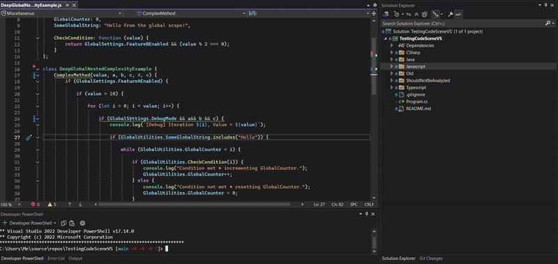

# CodeScene - Code Analysis and Refactoring

[CodeScene](http://www.codescene.com) - the only code analysis tool with a proven business impact.

## Code Health Analysis
CodeScene’s [Code Health](https://codescene.io/docs/guides/technical/code-health.html) metric is the software industry’s only code-level metric with proven business impact, measured through fact-based, winning research. It’s a metric that you can trust.

The extension analyses and scores your code as you type, and adds diagnostic items that highlights any code smells.

### Language support
CodeScene supports [most popular languages](https://codescene.io/docs/usage/language-support.html#supported-programming-languages).

## Code Smells

Code smells often lead to issues such as increased technical debt, more bugs, and reduced overall quality of the software.

You can find detailed information for each code smell by examining the diagnostics (squigglies or in the Problems view).

## Do you want to keep using CodeScene ACE?

Our AI-powered refactoring agent, CodeScene ACE, previously available for free during the beta phase, ACE will now be
offered as an add-on to the extension. If you’re interested in continuing to use CodeScene ACE or would like to share
feedback, [reach out](https://codescene.com/contact-us-about-codescene-ace) to our Sales team.
